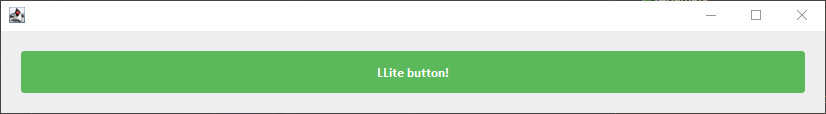

## Lumina Lite
**Lumina** is my personal project to implement a simple, functional CSS language
into a JFrame interface while minimizing the amount of Java code required. The project itself
has been in development for a long time and already has over 8,000 lines of code.

However, since the project isn’t fully implemented yet, I need a tool to handle this task
for my current projects. That’s why I quickly wrote
a very stripped-down version of this framework that focuses on its core functionality.

Most likely, this lightweight project will receive minimal updates as needed
and will be abandoned once its “parent” project is completed.

The main version of this library currently under development includes its own language compiler, which makes it easy to write theme files and almost completely eliminates the need for routine code. It supports keyframes, parameter types, inheritance, imports, contexts, unit numbers, and much more.

### Example of usage: [file](src%2Fmain%2Fjava%2Fcom%2Fumiomikket%2Fllite%2FTestButton.java)
```java
public static JButton getButton() {
    LuminaButton button = new LuminaButton(
        ic -> {
            DefaultRenderContext c = (DefaultRenderContext) ic;
            c.enableAntialiasing();
            float strokeWidth = 1.0f;
            float halfStroke = strokeWidth / 2.0f;
            float x = halfStroke, y = halfStroke;
            float w = c.x(1f) - strokeWidth;
            float h = c.y(1f) - strokeWidth;
            c.color(c.value("background", Color.class));
            c.fillRoundedRect(x, y, w, h, 3);
            c.color(c.value("border", Color.class));
            c.stroke(strokeWidth);
            c.drawRoundedRect(x, y, w, h, 3);
        }
    );

    button.setText("LLite button!");
    button.setForeground(Color.WHITE);
    button.setFont(new Font("Segoe UI", Font.BOLD, 12));
    
    ComponentAnimator animator = button.getHelpher().getAnimator();
    Stage defaultStage = Stage.builder()
        .function((isFocused, isHovered, isPressed, isEnabled, isDisabled) -> !(isHovered || isPressed || isDisabled))
        .property("background", Color.decode("#5cb85c"))
        .property("border", Color.decode("#5cb85c"))
        .ease(Ease.EASE_IN_OUT_QUAD)
        .duration(150)
        .build();
    animator.getStages().add(defaultStage);
    animator.setCurrentProperties(defaultStage);
    animator.getStages().add(
        Stage.builder()
        .function((isFocused, isHovered, isPressed, isEnabled, isDisabled) -> isHovered)
        .property("background", Color.decode("#4e9c4e"))
        .property("border", Color.decode("#4a934a"))
        .ease(Ease.EASE_IN_OUT_QUAD)
        .duration(150)
        .build()
    );

    return button;
}
```